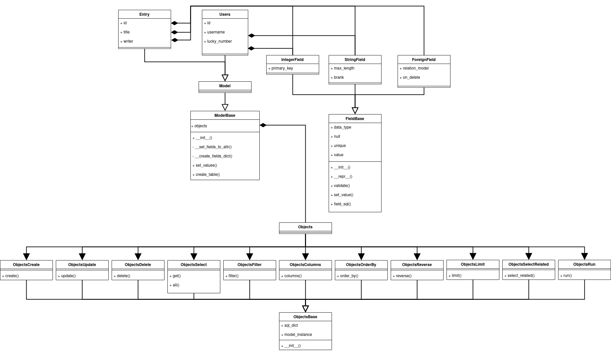
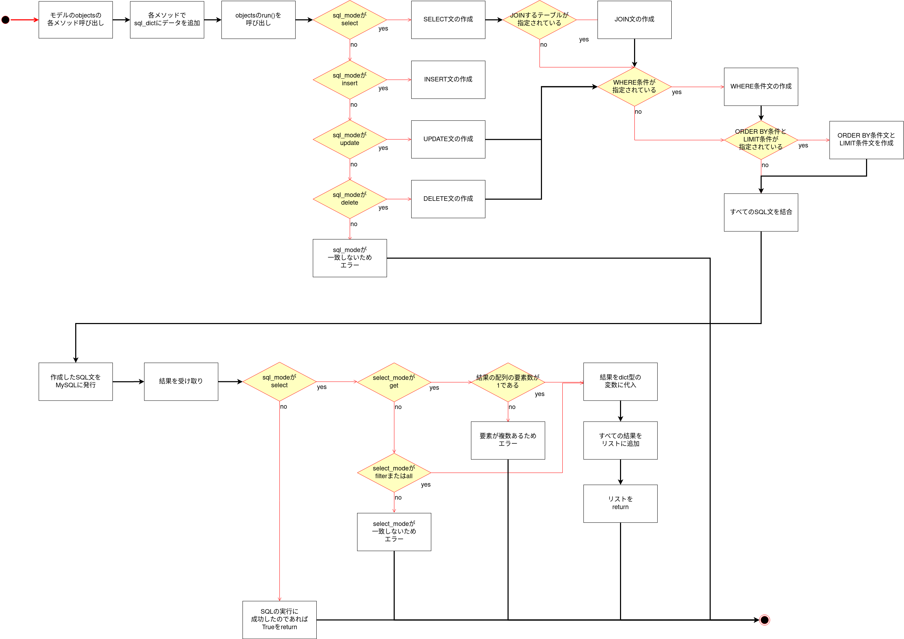

Python製、力技自作ORMです。

 

# 実装している機能

- create関数によるINSERT機能
- get関数、all関数によるSELECT機能
- update関数によるUPDATE機能
- delete関数によるDELETE機能
- filter関数によるWHERE条件指定
- select_related関数によるN+1問題解消機能（1テーブル結合までは動作確認済）
- order_by関数、reverse関数によるオーダー変更機能
- limit関数によるLIMIT機能

 

# 未実装の機能

- ORDER BY機能を使用していない場合の昇順降順変更機能
- GROUP BY機能、HAVING機能
- WHERE条件のLIKE機能
- その他多くの機能

 

# 問題点

- アルゴリズムの最適化(計算量、速さ)
- DRYの原則の違反

 

# 使い方

## モデル作成

	modelsフォルダに、モデルクラスを作成する。
	モデルクラスは、`framework.models.model`内の`Model`クラスを継承する。

	モデルクラスのクラス変数としてカラムを作成する。

	カラムは、`framework.fields`内の`IntegerField`や`StringField`、`ForeignField`を使用して作成する。

	作成したモデルクラスをmodelsフォルダの__init__のmodelsリストに追加する。

	`framework.operates.create_table`内の`create_all_table`関数を呼び出すことでSQLが発行されてモデルがRDBに作成される。

	例)
	from myorm.models.model import Model
	from myorm.fields import IntegerField, StringField, ForeignField
	from myorm.models import CASCADE

	class Users(Model):

		id = IntegerField(null=False, unique=True, primary_key=True)
		username = StringField(max_length=30, null=False, unique=True, brank=False)
		password = StringField(max_length=20, null=False, unique=False, brank=False)

	
	class Entry(Model):

		id = IntegerField(null=False, unique=True, primary_key=True)
		title = StringField(max_length=30, null=False, unique=False, brank=False)
		content = StringField(max_length=2000, null=False, unique=False, brank=True)
		writer = ForeignField(Users, on_delete=CASCADE, null=False)

 

## データ作成(INSERT)

	モデルクラスをインスタンス化する。
	
	次にモデルクラスの`objects`の`create`関数を呼び出す。
	`create`関数に挿入するデータを受け渡す。最後にrun関数を呼び出す。

	例) Usersクラスであれば、
	Users().objects.create(username="sample", password="password").run()
	となる。

 

## データ取得

	例)
	一つ取得
	Users().objects.get(username="sample").run()

	複数取得
	Users().objects.filter(username="sample").run()

	全取得
	Users().objects.all().run()

 

## データ変更（UPDATE）

	例)
	ユーザネームが"sample"のユーザのユーザネームを"sample2"に変更
	Users().objects.update(username="sapmle2").filter(username="sample").run()

 

## データ削除

	例)
	ユーザネームが"sample"のユーザを削除
	Users().objects.delete().filter(username="sample").run()

 

## 関連テーブル同時取得(N+1問題解消)

	例)
	エントリテーブルからデータを取得する際に、著者データも取得する。
	Entry().objects.get(id=1).select_related("writer").run()

 

## オーダー機能
	例)
	idをキーに、昇順で並び替え
	Users().objects.all().order_by("id").run()

	idをキーに、降順で並び替え
	Users().objects.all().order_by("id").reverse().run()

 

## リミット機能

	例)
	10件
	Users().objects.all().limit(10).run()

 
 

# UML

## クラス図

 

## シーケンス図

